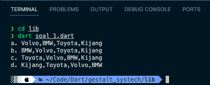

# 📋 Gestalt Systech - Technical Test

🚀 Ketentuan :

a. Menggunakan bahasa pemograman yang dikuasai, buatlah file terpisah masing-masing nomor
soal berisikan kode program dari soal-soal berikut ini.
b. Siapkan kode program tersebut sehingga saat dibuka / compile otomatis akan mengeluarkan
hasil keluaran yang diharapkan.
c. Pada setiap file berikan juga catatan berapa lama anda mengerjakan hal tersebut & bahasa
pemograman apa yang anda gunakan.
d. Silakan export hasil sql yang anda buat pada soal nomor 6 dan masukan kedalam pengumpulanfile
yang akan diberikan.

🤖 Notes:

Gunakanlah waktu sebaik mungkin, originalitas code menjadi salah satu point penilaian dengan
bobot tertinggi, lakukan juga Pattern Recognition untuk memecahkan setiap soal yang ada.

Waktu Pengiriman Source Code kembali kepada kami adalah Maximal 24 Jam dari email diterima.

Selamat Mengerjakan!

---

## 1. Buatlah sebuah array menggunakan script dengan contoh array "Volvo", "BMW" "Toyota","Kijang". Lalu buatlah sebuah perulangan dengan keluaran sebagai berikut :

a. "Volvo","BMW","Toyota","Kijang"
b. "BMW","Volvo","Toyota","Kijang"
c. "Toyota","Volvo","BMW","Kijang"
d. "Kijang","Toyota","Volvo","BMW"

Jawaban:

---

## 2. Buatkah sebuah perulangan dari angka 1 sampai 10 dengan contoh hasil keluaran sebagai berikut :

Kamu memiliki string yang merepresentasikan angka '3943' lalu diberikan sebuah variabel k untuk melakukan replacement karakter sejumlah k pada string agar menjadi bentuk palindrom.

- 01
- 002
- 0003
- 00004
- 000005
- 6000000
- 70000000
- 800000000
- 9000000000
- 10000000000

Jawaban:

---

## 3. Hitunglah perbedaan tanggal antara "2008-03-24" dan "2010-06-26" menggunakan PHP dengan contoh hasil keluaran sebagai berikut :

- 2 tahun, 3 bulan, 4 hari

Jawaban:

---

## 4. Lakukanlan sebuah perulangan dengan variable array sebagai berikut :
    
    $datadiri = array(
        "Bimo Nasuti" => array(
            "mob" => "654544455",
            "email" => "<bimonasuti@gmail.com>",
            "hp" => "08123456787",
        ),
        "Bimo Nasuti II" => array(
            "mob" => "1231354897",
            "email" => "<bombomi@gmail.com>",
        ),
        "Yuni Salam" => array(
            "mob" => "512512662",
            "email" => "<yunisalam@gmail.com>",
            "hp" => "08123456787",
        )
    );

dengan syarat data tanpa nomor handphone dimunculkan dengan label "Tidak Memiliki No
Handphone".

Jawaban:

---

## 5. Jika seseorang memiliki uang sebesar Rp. 1.586.000,- dan ingin memecahkan uang tersebut menjadi pecahan Rp.100.000,-; Rp.50.000,-; Rp.20.000,-; Rp.10.000,-; Rp.5.000,- dan Rp.1.000. Dengan menggunakan script PHP, tentunkan banyaknya masing-masing uang pecahan yang diproleh orang tersebut.

Jawaban:

---
